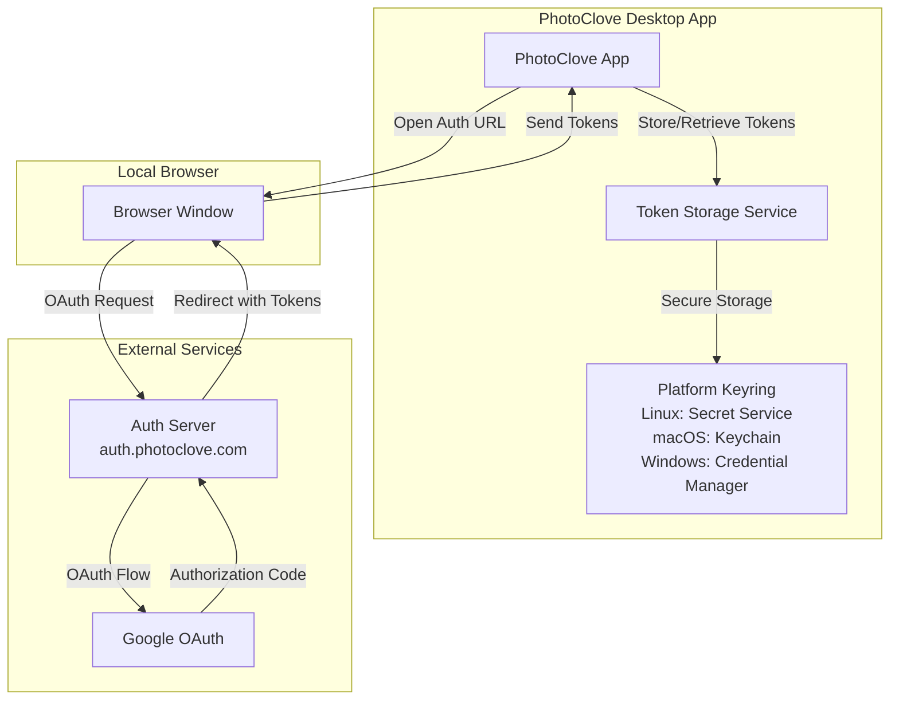
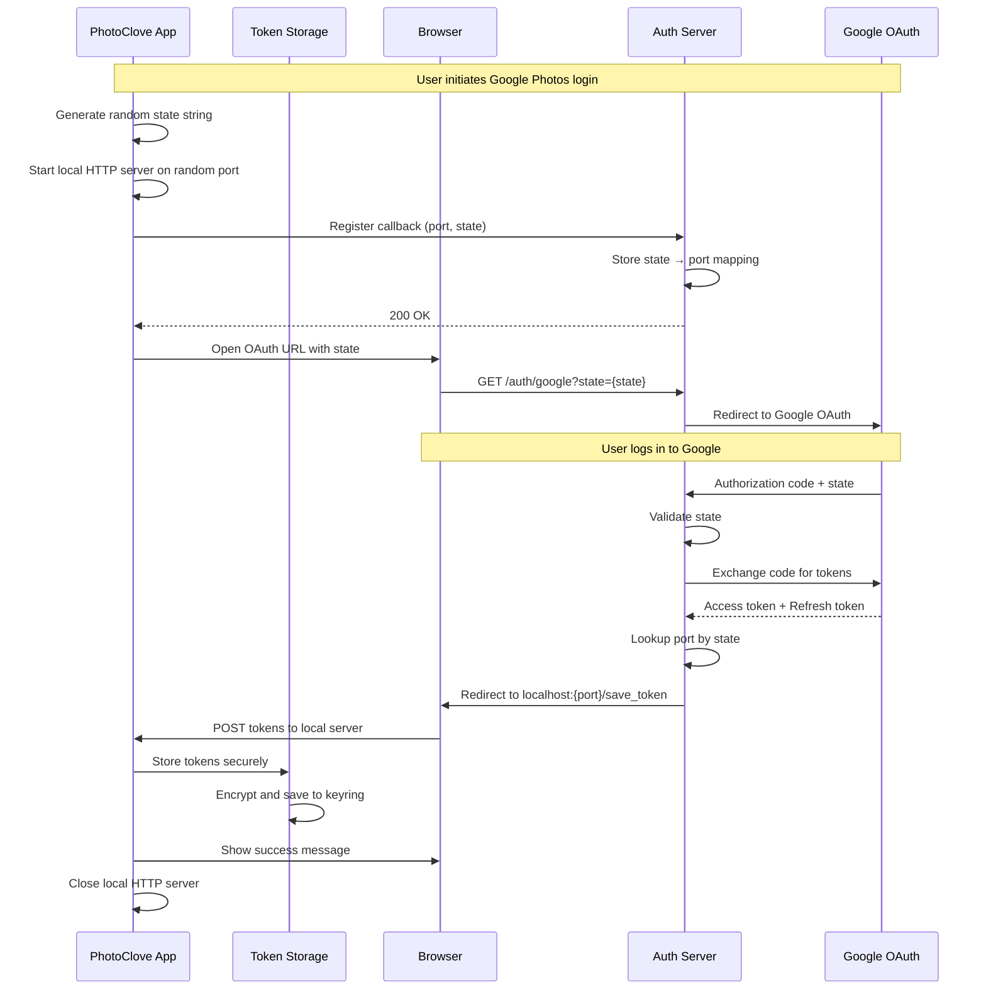
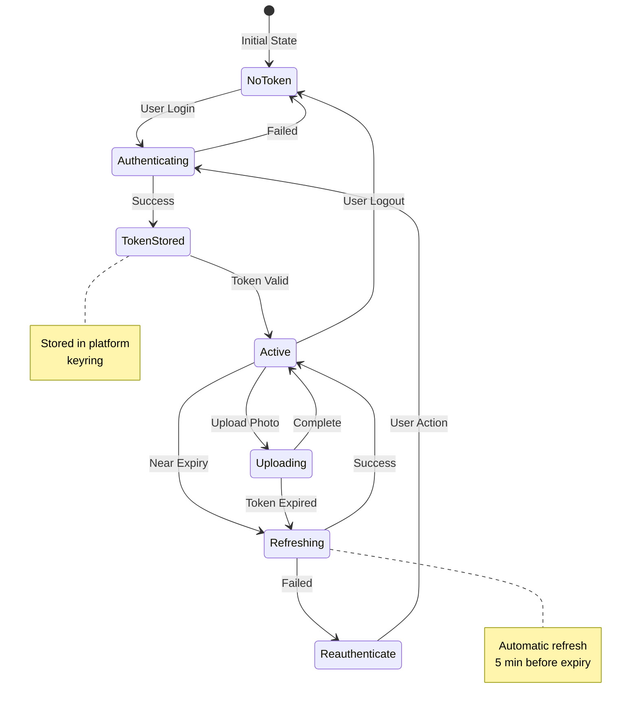
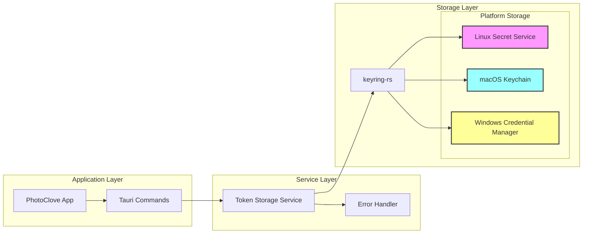
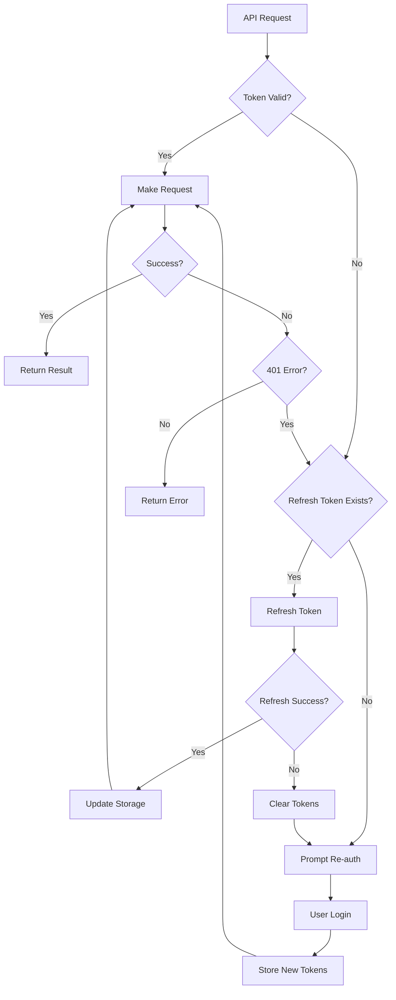
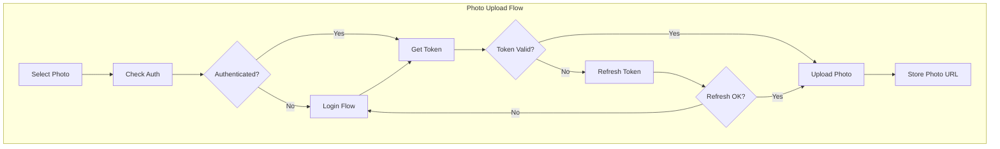

# OAuth Authentication Flow

## Overview

PhotoClove uses a secure OAuth 2.0 authentication flow for Google Photos integration. The authentication process involves an external authentication server that handles the OAuth flow, ensuring that client secrets are never exposed to the desktop application.

## Authentication Architecture



## OAuth Flow Sequence



## Token Lifecycle Management



## Token Storage Architecture



## Error Handling Flow



## Security Features

### 1. No Client Secrets
- OAuth client ID and secret never stored in the desktop app
- External auth server handles all OAuth credential exchanges
- Desktop app only receives and stores user tokens

### 2. Secure Token Storage
- Tokens encrypted by platform-native keyring systems
- Never stored in plain text files or application memory
- Automatic cleanup on application uninstall

### 3. State Validation
- Random state parameter prevents CSRF attacks
- State verified by auth server before token exchange
- One-time use prevents replay attacks

### 4. Automatic Token Refresh
- Tokens refreshed 5 minutes before expiration
- Refresh happens transparently during API calls
- Failed refresh triggers re-authentication

## Implementation Details

### Frontend (JavaScript)
```javascript
// src/services/firebase/auth.js
class GooglePhotosAuth {
    async login() {
        // 1. Generate random state
        // 2. Start local server
        // 3. Register with auth server
        // 4. Open browser for OAuth
        // 5. Wait for callback
        // 6. Store tokens via Tauri
    }
}
```

### Backend (Rust)
```rust
// src-tauri/src/domain_service/token_storage_service.rs
pub struct TokenStorageService {
    keyring: Entry,
}

impl TokenStorageService {
    pub fn store_tokens(&self, tokens: GoogleTokens) -> Result<()> {
        // Serialize and encrypt tokens
        // Store in platform keyring
    }
    
    pub fn get_tokens(&self) -> Result<GoogleTokens> {
        // Retrieve from keyring
        // Decrypt and deserialize
    }
    
    pub fn refresh_if_needed(&self) -> Result<()> {
        // Check expiration
        // Refresh if < 5 minutes remaining
    }
}
```

### Auth Server
The external auth server (auth.photoclove.com) handles:
1. OAuth client credentials
2. State validation
3. Token exchange with Google
4. Secure redirect to desktop app

## Testing and Debugging

### Debug Commands
PhotoClove includes built-in commands for testing OAuth functionality:

```bash
# Test keyring storage
photoclove test keyring

# Show current token status
photoclove google-auth status

# Manually refresh token
photoclove google-auth refresh

# Clear stored credentials
photoclove google-auth clear
```

### Common Issues

1. **Token Storage Fails**
   - Ensure keyring service is running (Linux)
   - Check keychain access permissions (macOS)
   - Verify Windows Credential Manager is enabled

2. **Refresh Token Invalid**
   - Token may be revoked by user
   - OAuth app may need re-authorization
   - Clear and re-authenticate

3. **Authentication Timeout**
   - Check firewall settings for localhost
   - Ensure browser can reach auth server
   - Verify state parameter matches

## API Integration



## Monitoring and Logging

All authentication events are logged with structured format:
- Login attempts and results
- Token refresh operations
- API authentication failures
- Keyring storage operations

Access logs via LogViewer (Ctrl+Shift+L) and filter by "auth" or "token" components.