# PhotoClove Feature Sequences

This document describes the frontend/backend interaction sequences for each major feature in PhotoClove.

## Application Startup Sequence

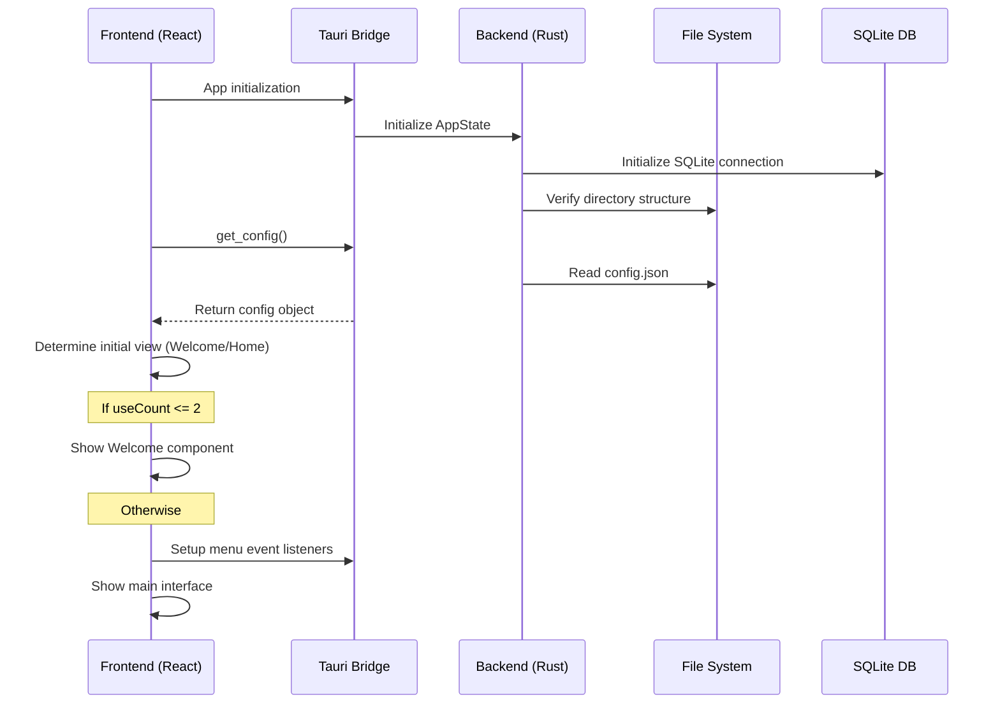

## Photo Import Feature

### 1. Import Directory Selection

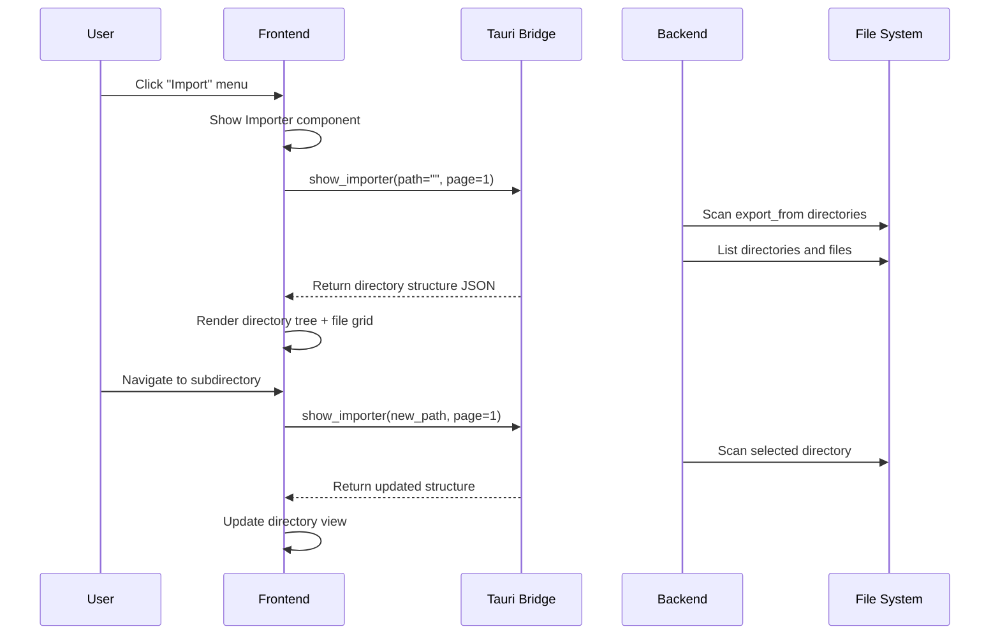

### 2. Photo Selection and Import

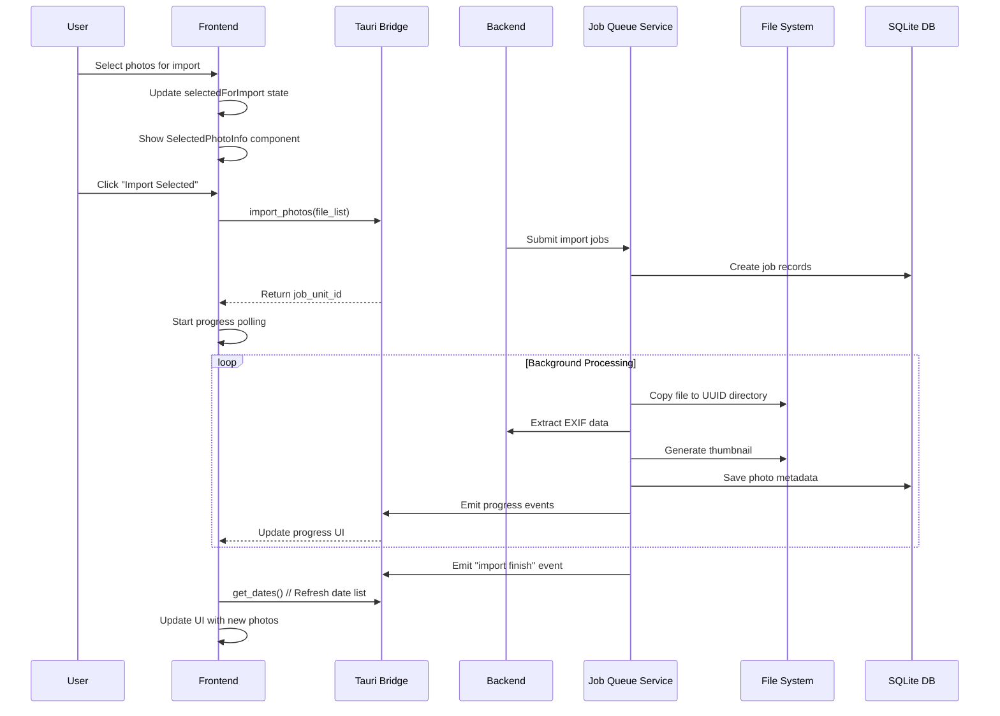

## Photo Viewing Feature

### 1. Date List Loading

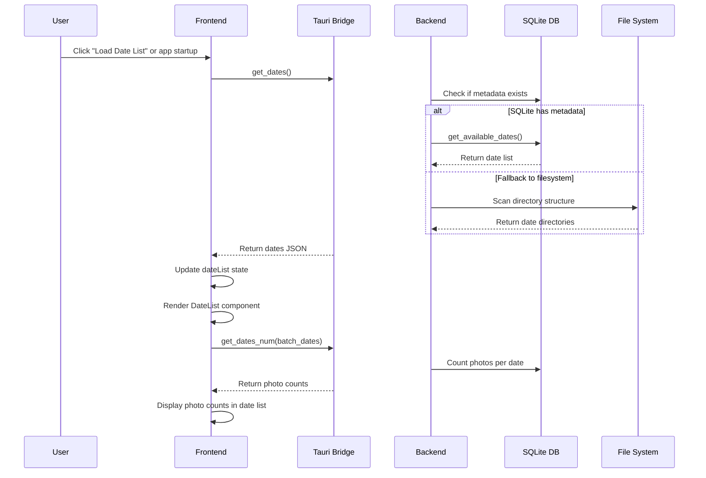

### 2. Photo Grid Display

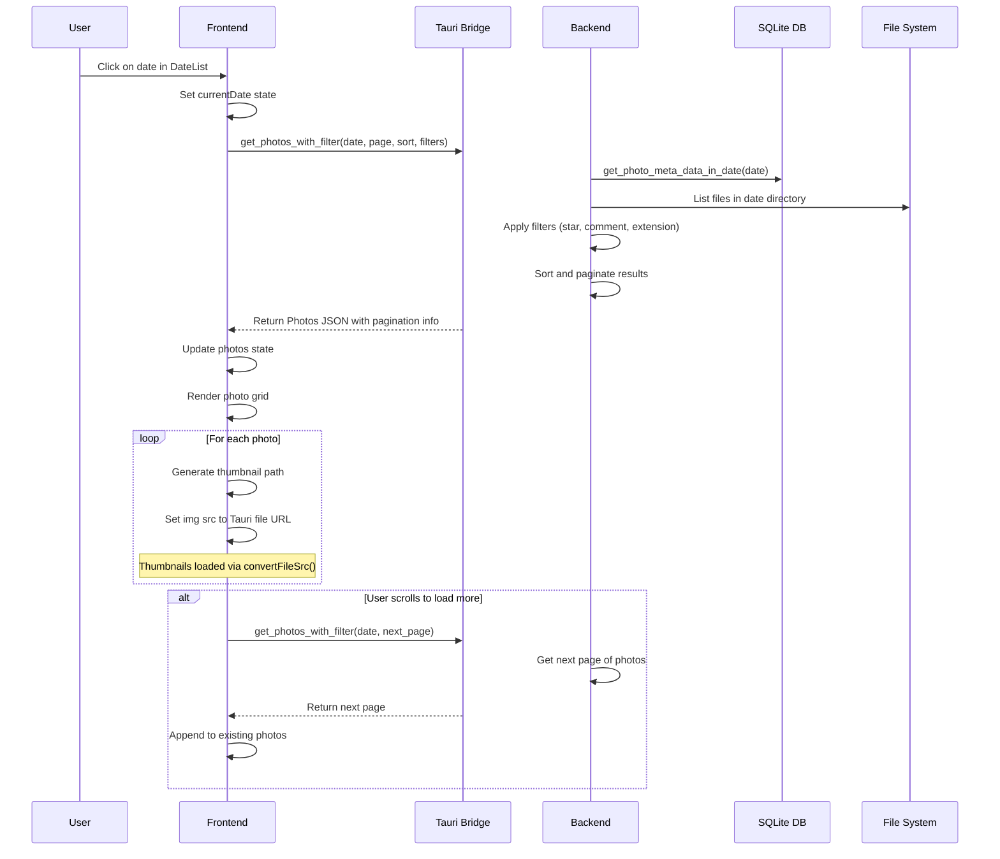

### 3. Full Photo Display

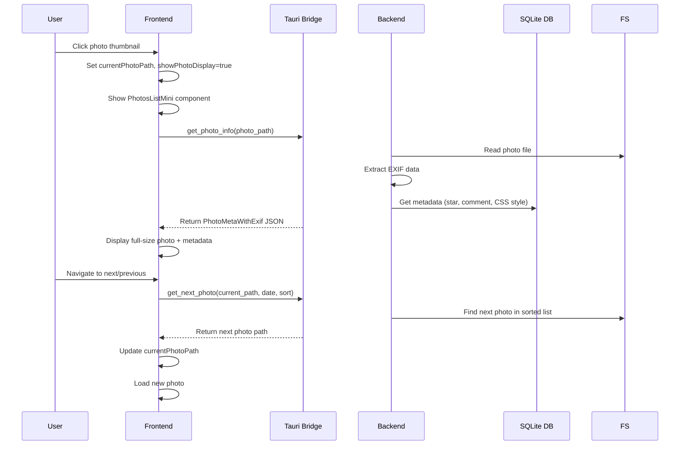

## Photo Editing Feature

### 1. Photo Transformations

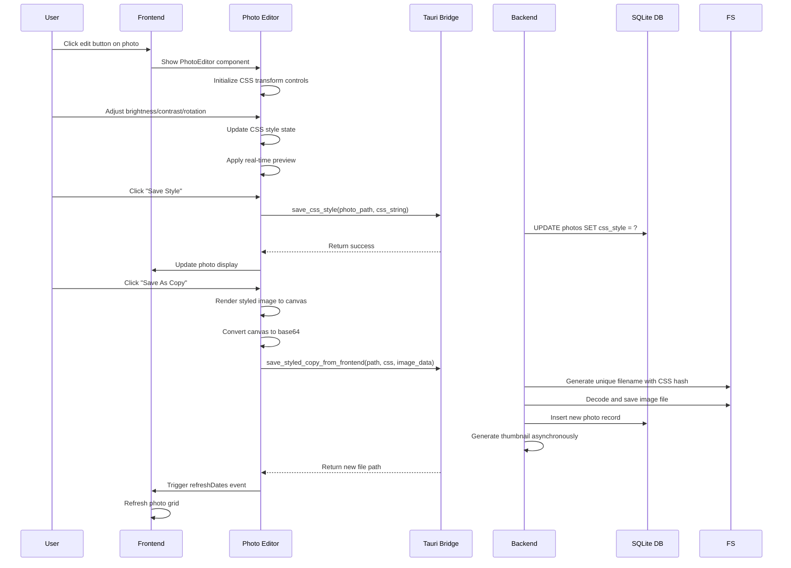

## Configuration Management

### 1. Preferences Update

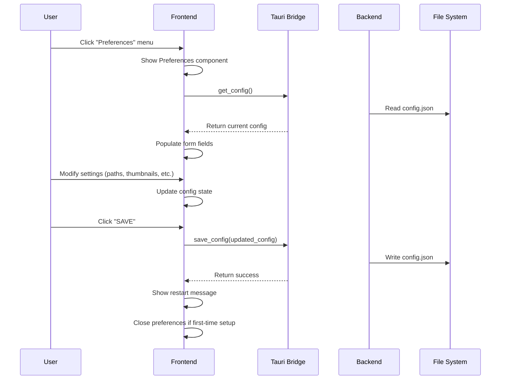

## Job Queue Management

### 1. Job Monitoring

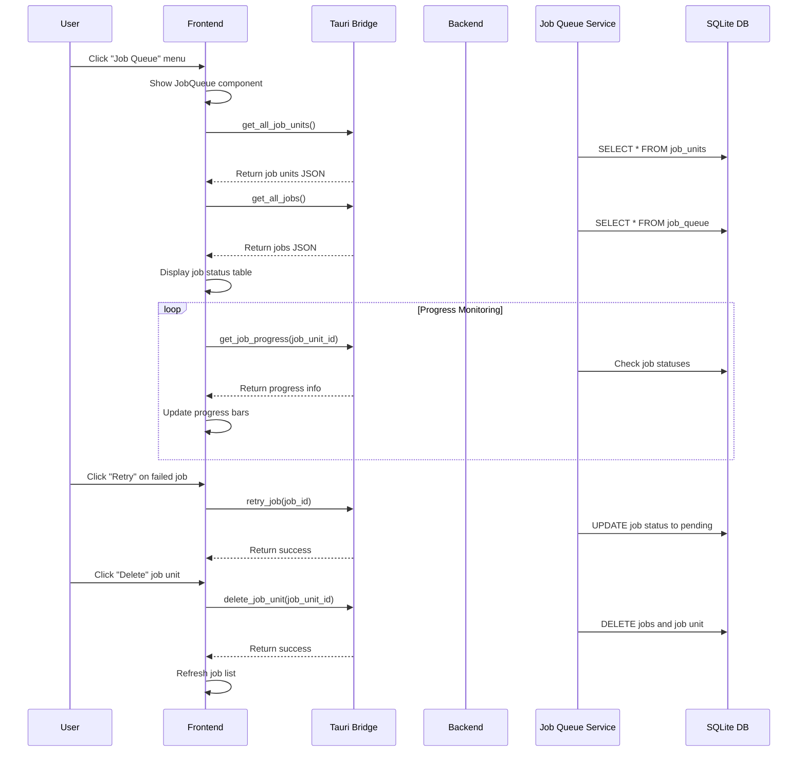

## Database Management

### 1. Database Creation/Update

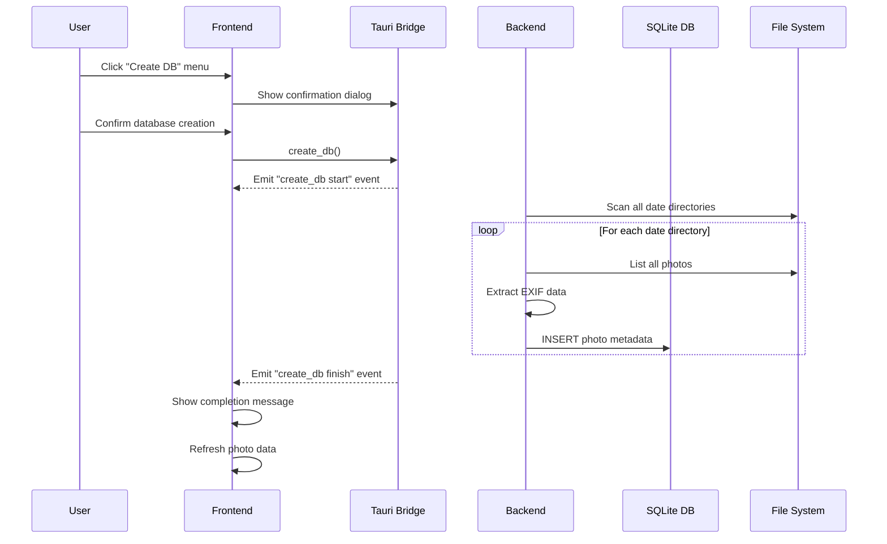

## Error Handling Patterns

### 1. Network/File Errors

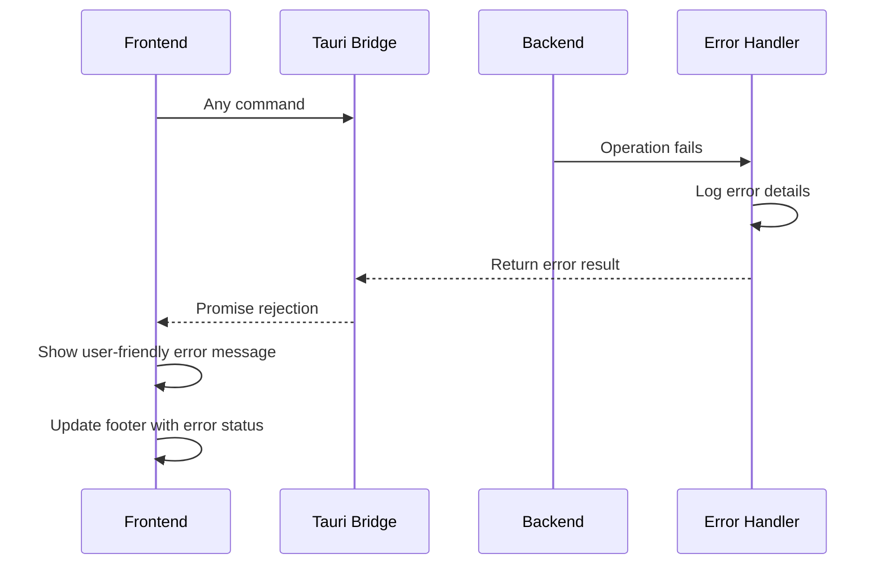

### 2. Concurrent Operation Locking

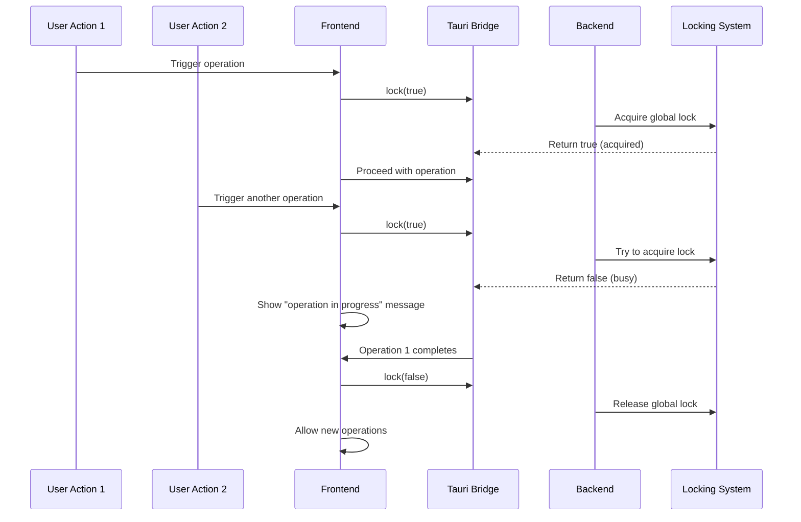

## Performance Optimization Strategies

### 1. Lazy Loading and Caching

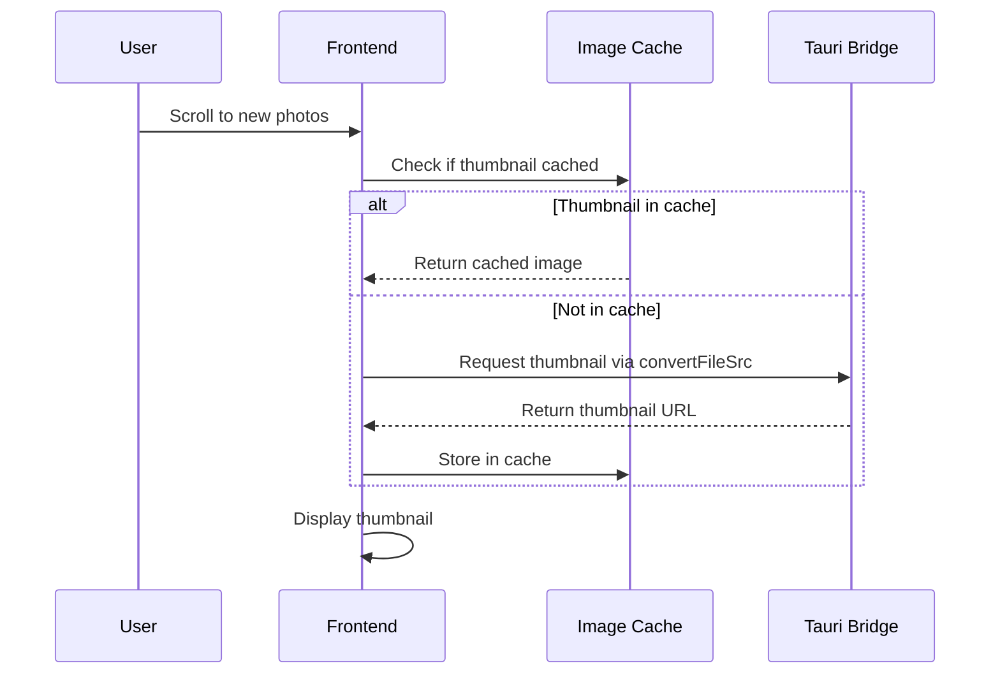

### 2. Background Processing

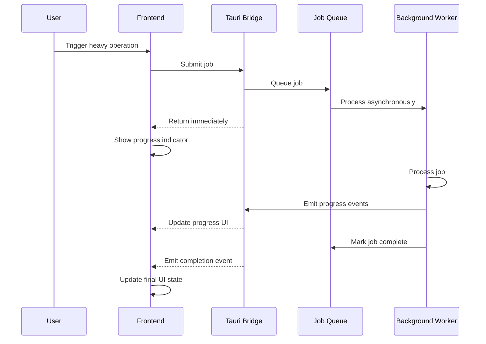

This document provides a comprehensive view of how the frontend and backend interact for each major feature in PhotoClove, showing the asynchronous nature of operations and the layered architecture pattern used throughout the application.