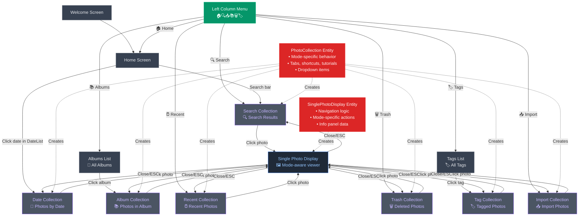

# PhotoClove Screen Transition Diagram

## DDD Architecture Overview

PhotoClove now uses Domain-Driven Design with the following key components:

### Entities
- **PhotoCollection**: Collection of photos with mode-specific behavior (album, date, search, trash, recent, tag, import)
- **SinglePhotoDisplay**: Single photo display state with navigation and mode-specific actions
- **ImportState**: Import functionality state management entity

### Value Objects
- **Photo**: Individual photo entity with display/thumbnail path methods and state
- **ViewMode**: Immutable value object that encapsulates view mode state and behavior

## Navigation Elements

### Left Column Menu (Always Available)
The green **Left Column Menu** node represents the persistent navigation icons:
- 🏠 **Home** - Return to home screen
- 🔍 **Search** - Open search mode (advanced search)
- 📥 **Import** - Import photos
- 📚 **Albums** - View albums
- 🗑️ **Trash** - View deleted photos
- 🏷️ **Tags** - View tagged photos
- ⏰ **Recent** - View recent photos

### Additional Fixed Navigation
- **Top Menus** - File, Help (?) - Available everywhere
- **ESC key** - Returns to previous screen or closes single photo display

## DDD Architecture Components

### Domain Components

#### Entities
- **PhotoCollection Entity**: Collection of photos with mode-specific behavior
  - Mode types: `album`, `date`, `search`, `trash`, `recent`, `tag`, `import`
  - Methods: `getTitle()`, `getAvailableTabs()`, `getKeyboardShortcuts()`, `getDropdownItems()`, `getTutorialSteps()`
- **SinglePhotoDisplay Entity**: Single photo display state with navigation logic
  - Methods: `next()`, `previous()`, `getNavigationInfo()`, `getAvailableActions()`
- **ImportState Entity**: Import functionality state management
  - Methods: Import path management, progress tracking, event handling

#### Value Objects
- **Photo Value Object**: Individual photo with methods for `displayPath()`, `thumbnailPath()`, `isVideo()`, etc.
  - Immutable state with methods: `withStar()`, `withComment()`, `moveToTrash()`, `restoreFromTrash()`
- **ViewMode Value Object**: Encapsulates view mode state and behavior
  - Mode checking methods: `isAlbumMode()`, `isTrashMode()`, etc.

### Screen Types

#### Collection Views (All use PhotosList component)
All collection views are created from a **PhotoCollection** entity with mode-specific behavior:

- **Date Collection** 📅: Photos from selected date
  - Tabs: Home, Recent, Albums, Search, Trash
  - Shortcuts: Standard navigation + create album from date
  - Actions: Move to trash, add to album, star rating

- **Search Collection** 🔍: Search results with filters
  - Tabs: All available
  - Shortcuts: Standard navigation + Ctrl+F for search focus
  - Actions: All standard actions + save search

- **Album Collection** 📚: Photos in selected album
  - Tabs: Home, Albums, Search, Trash (limited set)
  - Shortcuts: Delete (remove from album), Ctrl+Delete (delete file)
  - Actions: Remove from album, delete file, reorder photos

- **Recent Collection** ⏰: Recently added photos
  - Tabs: All available
  - Shortcuts: Standard navigation
  - Actions: Standard photo actions

- **Trash Collection** 🗑️: Deleted photos with restore options
  - Tabs: Home, Recent, Albums, Search (no trash tab)
  - Shortcuts: Delete (permanent), R (restore)
  - Actions: Restore, delete permanently

- **Tag Collection** 🏷️: Photos with specific tag
  - Tabs: All available
  - Shortcuts: Standard navigation
  - Actions: Remove tag, standard photo actions

- **Import Collection** 📥: Photos from import directories
  - Tabs: Home, Recent, Albums, Search (standard set)
  - Shortcuts: Standard navigation + import-specific actions
  - Actions: Select photos for import, navigate directories, import selected photos

#### Single Photo Display (Unified viewer)
The **Single Photo Display** is a unified viewer that adapts its behavior based on the source collection:

- **Mode-aware Actions**: Available actions change based on source (album: remove from album, trash: restore/delete permanently)
- **Context-aware Navigation**: Navigation respects the source collection's photo order
- **Dynamic Shortcuts**: Keyboard shortcuts adapt to the current mode
- **Smart Info Panel**: Shows relevant information based on photo state and source

### Architecture Benefits

1. **Unified Interface**: Single PhotosList component handles all collection types
2. **Mode-specific Behavior**: Each mode provides its own tabs, shortcuts, and actions
3. **Clean State Management**: Collections encapsulate their own display logic
4. **Easy Extension**: New modes can be added by creating new PhotoCollection types
5. **Consistent UX**: All modes follow the same interaction patterns while providing mode-specific functionality

### Data Flow

1. **Backend Data** → **PhotoService** → **Photo Entities**
2. **Photo Entities** → **PhotoCollection.create*()** → **Collection with Mode**
3. **PhotoCollection** → **PhotosList Component** (simplified props)
4. **Photo Click** → **SinglePhotoDisplay.fromCollection()** → **Single Photo Mode**
5. **Navigation/Actions** → **Domain Methods** → **Updated Entities** → **React State**

### Legacy Compatibility

The new architecture maintains backward compatibility through:
- `Photo.toLegacyFormat()` method for existing components
- `PhotoService.toLegacyFormat()` for bulk conversion
- Gradual migration path without breaking existing functionality