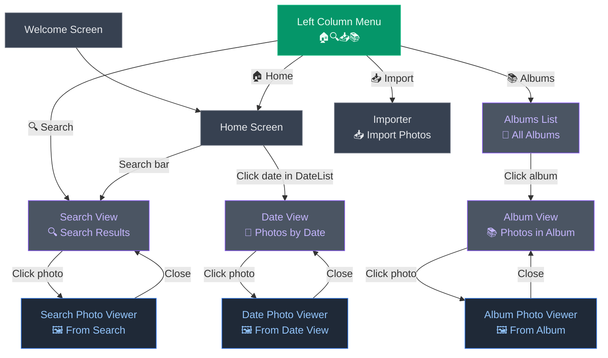

# PhotoClove Screen Transition Diagram

## Navigation Elements

### Left Column Menu (Always Available)
The green **Left Column Menu** node represents the persistent navigation icons:
- 🏠 **Home** - Return to home screen
- 🔍 **Search** - Open search mode (advanced search)
- 📥 **Import** - Import photos
- 📚 **Albums** - View albums

### Additional Fixed Navigation
- **Top Menus** - File, Help (?) - Available everywhere
- **ESC key** - Returns to previous screen

## Screen Descriptions

### Core Screens
- **Welcome**: First-time setup (2 uses only)
- **Home**: Shows search bar and welcome image (DateList is in left sidebar)
- **Date View** 📅: Photos from selected date (uses PhotosList component)
- **Search View** 🔍: Search results page (uses PhotosList component)
- **Album View** 📚: Photos in selected album (uses PhotosList component)
- **Albums List** 📁: Grid of all albums (uses PhotosList component)
- **Importer** 📥: Directory scanning and photo import interface
- **Date Photo Viewer** 🖼️: Full-screen photo view from date selection
- **Search Photo Viewer** 🖼️: Full-screen photo view from search results
- **Album Photo Viewer** 🖼️: Full-screen photo view from album

### Component Notes
- **Date View**, **Search View**, **Album View**, and **Albums List** all use the same `PhotosList.jsx` component
- **Date Photo Viewer**, **Search Photo Viewer**, and **Album Photo Viewer** all use the same `PhotosListMini.jsx` component
- They appear as different pages to the user but share the same codebase
- Each photo viewer closes back to its specific originating view (the list view remains underneath)

### Navigation Notes
- **Left Column Menu** provides main navigation icons (always accessible)
- **Home screen** has dual search paths: search bar for quick search, search icon for advanced search
- **DateList** (in left sidebar) allows direct date selection to DateView  
- Clicking a photo opens Photo Viewer overlay
- Photo Viewer closes back to the underlying list view  
- Import stays open after importing photos (user manually navigates to other views)